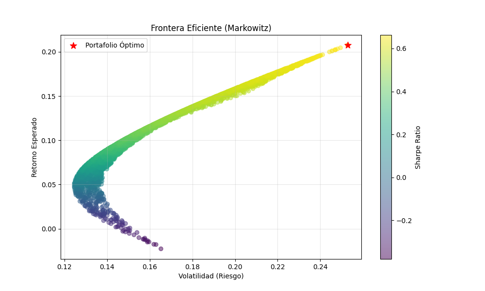

# 📈 Sistema de Análisis y Optimización de Portafolios de Inversión

[](https://www.python.org/)
[](https://pypi.org/project/XlsxWriter/)
[](https://en.wikipedia.org/wiki/Modern_portfolio_theory)

> **Ver Reporte Web Interactivo:** [🔗 Click aquí para ver el Portafolio desplegado](https://TU_USUARIO.github.io/NOMBRE_DEL_REPOSITORIO/)

## 📋 Descripción del Proyecto

Este proyecto automatiza el flujo de trabajo de un Analista de Inversiones, integrando la extracción de datos financieros, el cálculo de métricas de riesgo avanzadas y la generación automática de reportes ejecutivos en Excel.

El objetivo es optimizar la toma de decisiones estratégicas mediante modelos cuantitativos (**Teoría Moderna de Portafolios de Markowitz**) y reducir el tiempo operativo mediante la automatización de procesos (**Python + Excel**).

### 🎯 Objetivos de Negocio Resueltos
* **Monitoreo de Mercado:** Extracción automática de precios ajustados (considerando dividendos y splits) para activos multi-clase (Renta Variable, Renta Fija, Tecnología).
* **Gestión de Riesgos:** Cálculo de **VaR (Value at Risk) Histórico al 95%** y Máximo Drawdown para dimensionar escenarios pesimistas.
* **Optimización de Estrategia:** Simulación de Monte Carlo (5,000 escenarios) para encontrar la asignación de activos que maximiza el Ratio de Sharpe.
* **Reporte Ejecutivo:** Generación de entregables en Excel con formato condicional y gráficos nativos listos para presentación gerencial.

---

## 🛠️ Stack Tecnológico

* **Lenguaje:** Python 3.x
* **Librerías de Análisis:** `pandas`, `numpy`, `yfinance` (Yahoo Finance API).
* **Visualización y Modelado:** `matplotlib`, `scipy`.
* **Automatización de Reportes:** `xlsxwriter` (Motor de escritura Excel avanzado).
* **Control de Versiones:** Git & GitHub Pages.

---

## 📊 Metodología Financiera

El análisis se centra en un portafolio diversificado compuesto por:
1.  **SPY (S&P 500):** Benchmark de mercado (Core).
2.  **TLT (Bonos 20+ Años):** Activo defensivo/descorrelacionado.
3.  **QQQ (Nasdaq 100):** Componente de crecimiento (Growth).

### Métricas Clave Implementadas
| Métrica | Descripción | Uso en el Proyecto |
| :--- | :--- | :--- |
| **CAGR** | Tasa de Crecimiento Anual Compuesto | Medir retorno real suavizado a largo plazo. |
| **Sharpe Ratio** | Retorno ajustado por riesgo | Principal KPI para la optimización de pesos. |
| **VaR (95%)** | Valor en Riesgo | "¿Cuánto es lo máximo que puedo perder en un día normal?". |
| **Frontera Eficiente** | Modelo Markowitz | Visualización de la relación riesgo/retorno óptima. |

---

## 📷 Galería de Resultados

### 1. Optimización de Portafolio (Frontera Eficiente)
*El modelo simula 5,000 combinaciones para encontrar la "Estrella Roja" (Máximo Sharpe).*


### 2. Reporte Automatizado en Excel
*El script genera este archivo automáticamente, incluyendo formatos condicionales (barras verdes) y gráficos insertados.*
> *Nota: El archivo `Reporte_Inversion_Completo.xlsx` se encuentra disponible en la carpeta raíz.*

---

## 🚀 Instalación y Uso

Si deseas replicar este análisis en tu entorno local:

1.  **Clonar el repositorio:**
    ```bash
    git clone [https://github.com/TU_USUARIO/NOMBRE_DEL_REPOSITORIO.git](https://github.com/TU_USUARIO/NOMBRE_DEL_REPOSITORIO.git)
    ```

2.  **Instalar dependencias:**
    ```bash
    pip install -r requirements.txt
    ```
    *(Las librerías principales son: pandas, numpy, yfinance, matplotlib, xlsxwriter)*

3.  **Ejecutar el Pipeline:**
    Para correr todo el análisis, generar las imágenes y el Excel nuevo:
    ```bash
    python src/main.py
    ```

---

## 👤 Autor

**Erick R. Solsol Alván**
*Estudiante de Economía | Especialización en Finanzas y Data Science*

[LinkedIn](TU_LINK_DE_LINKEDIN) | [Portafolio Web](https://TU_USUARIO.github.io)

- Los datos crudos se colocan en `data/raw/` y no se versionan por defecto.
- `data/processed/` puede contener artefactos derivados que sí quieras versionar.
- Edita `src/` para añadir tus funciones de carga, limpieza y modelado.
